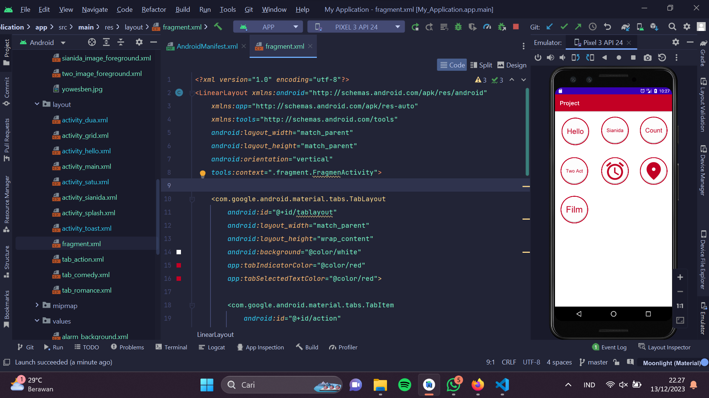
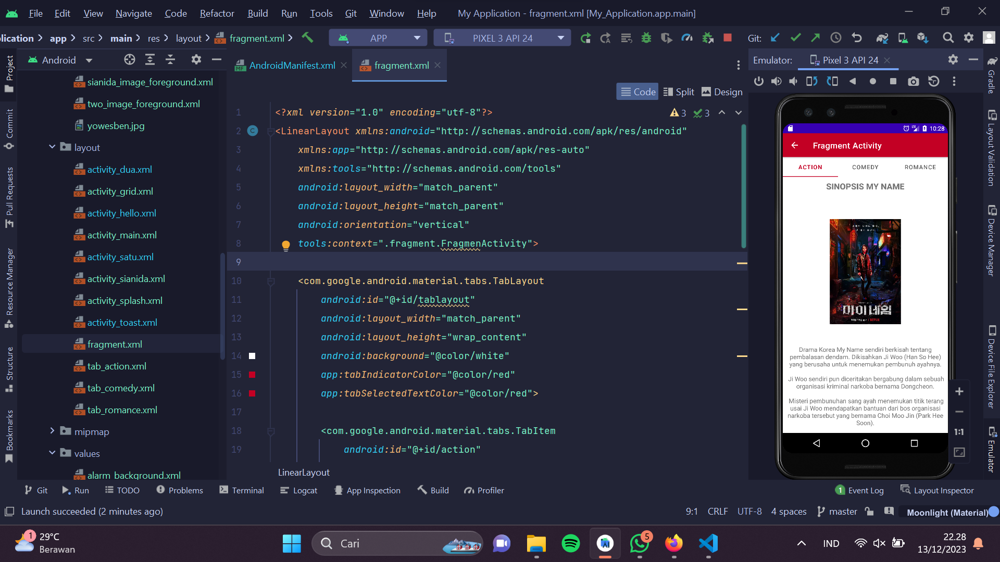
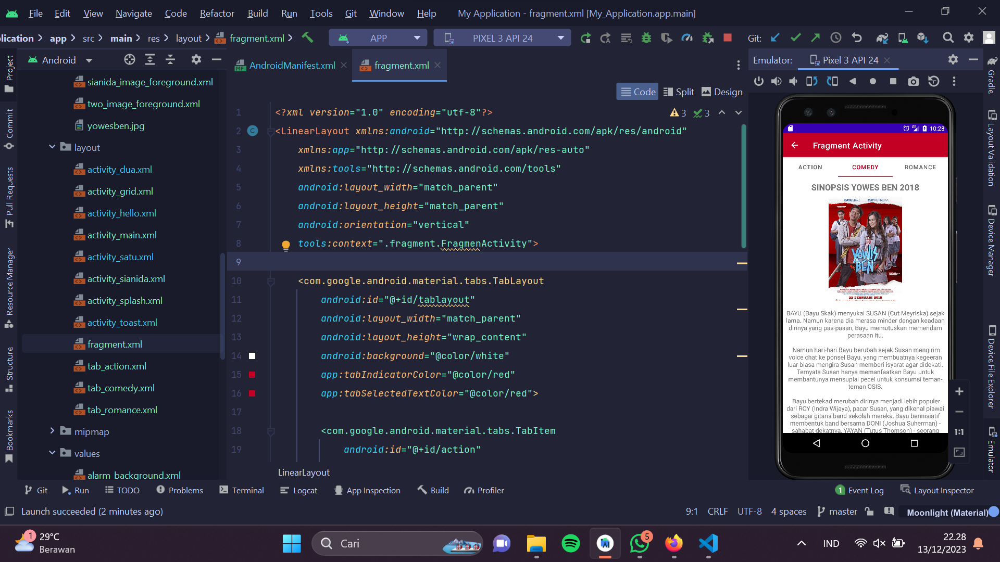
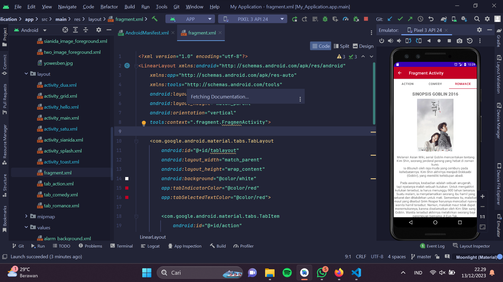

# Pemob1-Pertemuan 12
# Membuat Fragmnet Activity
## Nama : Herlan Wibowo
## NIM : 312210324
## Kelas : TI 22 A3
### Tugas ke-12
Buatlah fragment menu dengan tema Genre Film (Action, Komedi dan Romance) 
tampilan bisa berisi sinopsis film dan gambar dari film tersebut 
contoh seperti ini :

### Hasil Tugas
- Saya Menambahkan FragmentActivity pada GridLayout Saya dengan nama "Film" 

- Menambahkan Tab untuk film bergenre Action

- Menambahkan Tab untuk film bergenre Comedy

- Menambahkan Tab untuk film bergenre Romance
 
